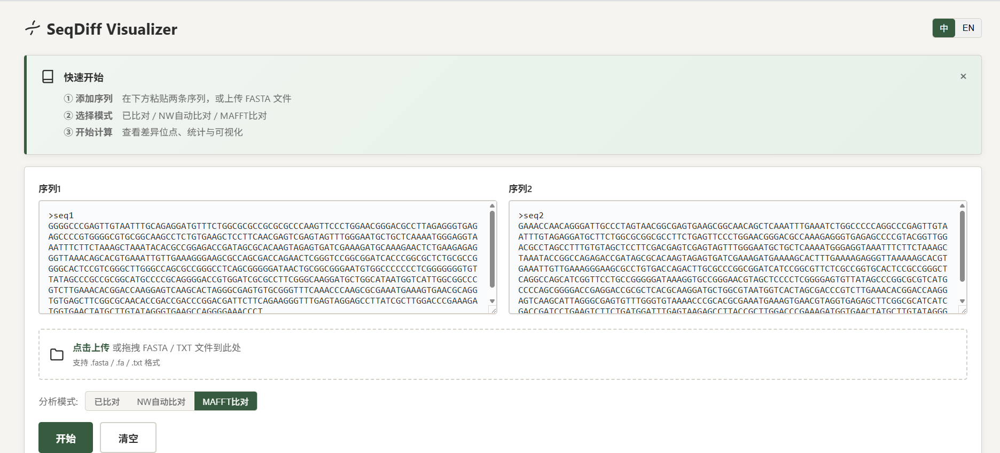
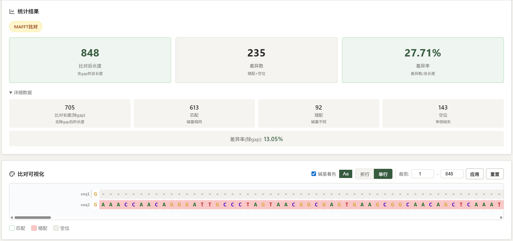

# SeqDiff Visualizer

**DNA Pairwise Alignment, Difference Analysis & Visualization**

A lightweight local tool for DNA pairwise alignment, difference analysis, difference-site localization, coordinate mapping, visualization, and CSV export.

一个用于 DNA 双序列比对、差异统计、差异位点定位、坐标映射、可视化与结果导出的本地分析工具。

---

## Overview

SeqDiff Visualizer is a lightweight local tool designed for comparing two DNA sequences. It integrates pairwise alignment, difference statistics, difference-site localization, alignment-to-sequence coordinate mapping, visualization, and CSV export into a single workflow.

The tool supports three alignment modes:

- **Pre-aligned** — directly compare sequences that have already been aligned
- **Needleman-Wunsch** — automatic global alignment
- **MAFFT** — professional alignment via local MAFFT installation

The tool is particularly useful when sequence comparison requires not only alignment, but also quantitative difference statistics and traceable difference positions in the original sequences.

---

## Workflow

```
Sequence Input
      ↓
  Alignment (Pre-aligned / NW / MAFFT)
      ↓
  Statistics (Identity / Mismatch / Gap)
      ↓
  Difference Detection
      ↓
  Coordinate Mapping (Alignment ↔ Sequence Position)
      ↓
  Visualization / CSV Export
```

---

## Key Features

### Alignment

- Pre-aligned sequence comparison
- Needleman-Wunsch global alignment (built-in)
- MAFFT local alignment (via local installation)
- Adjustable gap-open and gap-extension parameters

### Difference Analysis

- Alignment length
- Identical sites
- Mismatch sites
- Gap sites
- Identity
- Mismatch rate
- Gap rate
- Difference / variable sites

### Coordinate Mapping

For each difference site, the tool reports:

- Alignment position
- Sequence 1 position
- Sequence 2 position
- Sequence 1 base
- Sequence 2 base
- Difference type

Alignment coordinates and original sequence coordinates are tracked separately to account for inserted gaps.

### Visualization

- Base-level coloring (A/T/C/G)
- Match / mismatch / gap highlighting
- Wrapped and single-line display
- Position information on hover
- Long-sequence visualization protection (>5000 bp)

### Data Handling

- FASTA / TXT upload
- FASTA multiline parsing
- Input validation (illegal character detection)
- Sequence trimming
- History records (up to 5)
- CSV export
- Chinese / English interface

---

## Screenshots

| Input Interface | Results & Statistics |
| :---: | :---: |
|  |  |

---

## Quick Start

### Windows — Recommended

Download the latest Windows release from [Releases](https://github.com/Qianmoss/seq-diff-visualizer/releases) and extract the archive.

Run `SeqDiff.exe`.

The application starts a local Flask server and opens the interface in the browser at `http://localhost:5000`.

- No Python installation required
- MAFFT is bundled with the Windows release
- No additional dependency setup is required for the portable release

### Run from Source

Prerequisites:

- Python 3.12+
- Flask
- MAFFT (place in `mafft-win/` directory)

```bash
pip install flask
python app.py
```

---

## Performance

- **≤ 3000 bp:** Full per-base visualization
- **3000–5000 bp:** Normal analysis and visualization with performance warning
- **> 5000 bp:** Simplified visualization while retaining full analysis functionality

Analysis and visualization are handled separately so that long sequences do not cause excessive DOM rendering.

---

## Project Structure

```
seq-diff-visualizer/
├── app.py              # Flask backend and entry point
├── index.html          # Frontend interface and interaction logic
├── README.md
├── LICENSE
├── start.bat           # Windows startup script
├── build.bat           # Windows build script
├── build.py            # Build helper
├── build.spec          # PyInstaller configuration
├── examples/
│   └── sample_rDNA.fasta
├── docs/
│   └── screenshots/
├── mafft-win/          # MAFFT executable (bundled in Windows release)
└── dist/               # PyInstaller build output (build artifact)
```

---

## Tech Stack

- Python 3.12
- Flask
- HTML / CSS / JavaScript
- Needleman-Wunsch algorithm
- MAFFT
- PyInstaller

---

## Engineering Considerations

### Input Validation

- FASTA parsing with multiline sequence support
- Blank-line handling
- Duplicate header detection
- Illegal character validation (IUPAC ambiguity codes supported)

### External Tool Integration

- Local MAFFT invocation with timeout handling
- Output parsing with error handling
- Failure and timeout reporting

### Long Sequence Handling

Analysis remains available for long sequences while visualization is simplified to avoid excessive browser rendering.

### Security

User-provided sequence content is escaped before being inserted into the HTML result table to prevent XSS.

---

## License

MIT License — see [LICENSE](LICENSE) for details.

---

## Acknowledgements

- [MAFFT](https://mafft.cbrc.jp/alignment/software/) — Multiple sequence alignment algorithm
- [Flask](https://flask.palletsprojects.com/) — Python web framework
